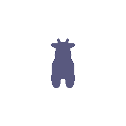
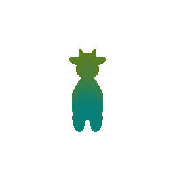
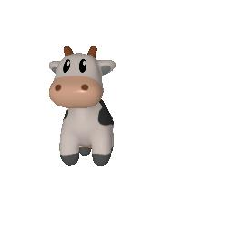
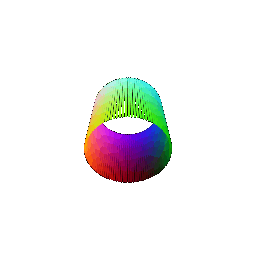
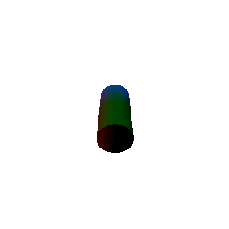

# Pytorch-3D-Representations-and-Renderings-

Basics of rendering with PyTorch3D, 3D representations, and practice constructing simple geometry.

## Setup

You will need to install Pytorch3d. See the directions for your platform [here](https://github.com/facebookresearch/pytorch3d/blob/main/INSTALL.md).
You will also need to install Pytorch. If you do not have a GPU, you can directly pip
install it (`pip install torch`). Otherwise, follow the installation directions [here](https://pytorch.org/get-started/locally/).

Other miscellaneous packages that you will need can be installed using the
`requirements.txt` file (`pip install -r requirements.txt`).

---

## Running Code

```
    python3 main.py --q {number}
```

**Examples**

```
ifargs.run =="q_11":
	print("#### 1.1. 360-degree Renders ####")
	subprocess.run(['python','q_11.py'])
elifargs.run =="q_12":
	print("####  1.2 Re-creating the Dolly Zoom ####")
	subprocess.run(['python','dolly_zoom.py'])
```

---

## 1. Practicing with Cameras

### 1.1. 360-degree Renders



### 1.2 Re-creating the Dolly Zoom


---

## 2. Practicing with Meshes

### 2.1 Constructing a Tetrahedron


**Tetrahedron:**

*Verticles: 4 Faces: 4*

### 2.2 Constructing a Cube


**Cube:**

*Verticles: 8 Faces: 12*

---

## 3. Re-texturing a mesh



Color1 is mix of Red and Green: color1=torch.tensor([1,1,0]) Color2 is mix of Green and Blue: color2=torch.tensor([0,1,1])

---

## 4. Camera Transformations

R_relative and T_relative are transforming the pose with respect to the frame w/t R_0 and T_0

**Transformation-1**


This is a rotation of around 90 degress in 'z' axis

```python
rotation= R.from_euler('z',-90,degrees=True)
R_rel=rotation.as_matrix().tolist()
T_rel=[0,0,0]
```

* R_rel: [[0, 1, 0], [-1, 0, 0], [0, 0, 1]]
* T_rel=[0,0,0]

**Transformation-2**


This is just a pure translation of 3 units around 'z' axis

* R_rel=[[1,0,0],[0,1,0],[0,0,1]]
* T_rel=[0,0,1]

**Transformation-3**



This is achieved by a slight rotation of 5 degrees around "y" axis and translation by 0.2 units in "x" axis

```python
rotation = R.from_euler('y', 5, degrees = True)  
        R_rel = rotation.as_matrix().tolist()
        T_rel = [0.2, 0, 0]
```

* R_rel=[[0.9961946980917457, 0.0, 0.08715574274765818], [0.0, 1.0000000000000002, 0.0], [-0.08715574274765818, 0.0, 0.9961946980917457]]
* T_rel=[0.2,0,0]

**Transformation-4**


This is achieved by rotating by 90 degress along "y" axis and then translating to first compensate for original translation and then translated with respect to the new rotated coordinate system by 3 units

```python
      rotation = R.from_euler('Y', 90, degrees = True)  
        R_rel = rotation.as_matrix().tolist()
        # According to the rotated frame
        T_rel = [-3, 0, 3]
```

* R_rel=[[0, 0.0, 1.0], [0.0, 1.0, 0.0], [-1.0, 0.0, 0]]
* T_rel=[-3,0,3]

---

## 5. Rendering Generic 3D Representations

### 5.1 Rendering Point Clouds from RGB-D Images


From left to right: generated point cloud renderings from Image1, Image2 and Combined by the union of both

### 5.2 Parametric Functions

### Torus Point Cloud - Parametric


### Cylinder Point Cloud(New Object) - Parametric



### 5.3 Implicit Surfaces

### Torus Point Cloud - Implicit


**Trade-offs Between Rendering as a Mesh vs. a Point Cloud:**

1. **Visual Quality:**
   * **Mesh:** Provides smoother surfaces and cleaner visuals due to connected geometry.
   * **Point Cloud:** Can display visible gaps if not dense enough, leading to lower visual quality.
2. **Rendering Speed:**
   * **Mesh:** Generally slower to render because of the complexity in handling surface connectivity.
   * **Point Cloud:** Faster to render since it's just a collection of discrete points without connectivity.
3. **Memory Usage:**
   * **Mesh:** Consumes more memory due to the additional data required for storing connectivity and surface information.
   * **Point Cloud:** More memory-efficient as it only stores the positions of individual points.

### Cylinder Point Cloud - Implicit



---

## 6. Something Fun

### ***Seasons on a Tree***

*I aimed to illustrate how a tree transforms across different seasons: Summer, Autumn, and Winter.*


**Procedure:** I downloaded the object file from [Tree Obj Source](https://free3d.com/3d-model/realistic-tree-02-134612.html) post which I changed the texture of the tree dependending on the rotation angle.

---

## 7. Sampling Points on Meshes


From left to right: Original Cow mesh, Generated points with sample size: [10,100,1000,10000] respectively

*The rendering generated from 10000 points looks very similar to the original mesh*
